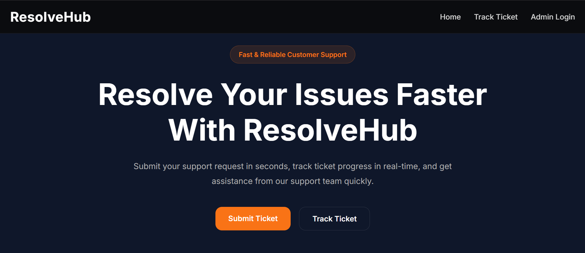
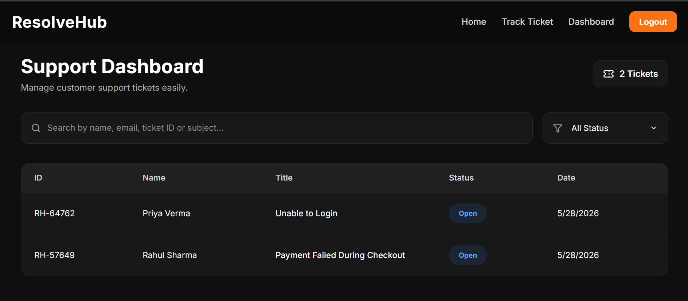
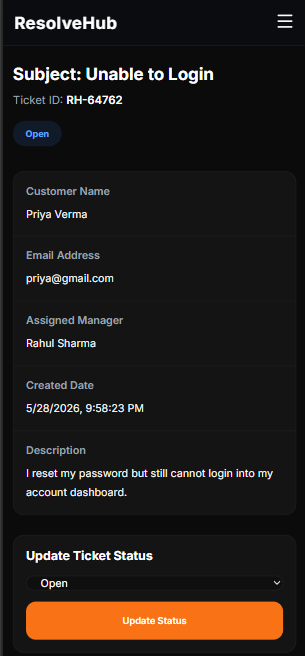

# ResolveHub CRM

A modern full-stack CRM (Customer Relationship Management) and support ticket management system built using the MERN stack. ResolveHub allows customers to raise support tickets and track their issues while admins can manage, review, update, and resolve customer problems through a professional dashboard.


---

# Live Demo

Frontend: https://resolvehubcrm.onrender.com/

Backend API: https://resolvehubcrm-backend.onrender.com

---

# Screenshots

## Home Page


## Admin Dashboard


## Mobile Responsive Design


---

# Features

## Customer Features

- Raise support tickets
- Generate unique tracking ID
- Track ticket status
- View support updates
- Responsive UI
- Real-time ticket workflow

---

## Admin Features

- Secure admin authentication
- JWT cookie-based authorization
- Protected admin routes
- View all tickets
- Search tickets
- Filter tickets by status
- Update ticket status
- Add support notes
- Timeline tracking system
- Responsive admin dashboard

---

# Tech Stack

## Frontend

- React.js
- React Router DOM
- Axios
- React Hot Toast
- Vanilla CSS
- Vite

---

## Backend

- Node.js
- Express.js
- MongoDB Atlas
- Mongoose
- JWT Authentication
- bcryptjs
- cookie-parser
- cors

---

# Project Architecture

```txt
Client (React Frontend)
        ↓
Express.js REST API
        ↓
MongoDB Atlas Database
```

---

# Folder Structure

```txt
ResolveHub/
│
├── client/                          # Frontend - React Application
│   ├── public/                      # Static assets
│   ├── src/                        # Main source code
│   │   ├── api/                    # Axios/API calls
│   │   ├── components/             # Reusable UI components
│   │   ├── pages/                  # Page-level components
│   │   ├── context/                # Auth & global state
│   │   ├── styles/                 # CSS files
│   │   └── App.jsx                 # Root component
│   │
│   ├── .env.example                # Frontend environment template
│   ├── package.json                # Frontend dependencies
│   └── vite.config.js             # Vite configuration
│
├── server/                          # Backend - Express API
│   ├── src/
│   │   ├── config/                 # DB connection & config files
│   │   ├── controllers/            # Business logic (auth, tickets)
│   │   ├── middleware/             # Auth & error handling middleware
│   │   ├── models/                 # Mongoose schemas
│   │   ├── routes/                 # API routes
│   │   ├── utils/                  # Helper functions (JWT, etc.)
│   │   └── app.js                  # Express app setup
│   └── server.js                  # Entry 
│   │
│   ├── .env.example                # Backend environment template
│   ├── package.json                # Backend dependencies
point
│
├── .gitignore                      # Ignored files (node_modules, .env)
├── README.md                       # Project documentation

```
---

# Installation & Setup

## Clone Repository

```bash
git clone https://github.com/AkhtarShaikh-7/ResolveHubCRM
```

---

# Backend Setup

## Navigate to Server

```bash
cd server
```

## Install Dependencies

```bash
npm install
```

## Create .env File

```env
PORT=3000

MONGO_URI=your_mongodb_connection_string

JWT_SECRET=your_secret_key

CORS_ORIGIN=http://localhost:5173
```

## Start Backend Server

```bash
npm run dev
```
```txt
http://localhost:3000
```
# 🔐 Admin Access Setup

This project does not include a frontend registration page for admin users.

This is a **security decision** to prevent unauthorized creation of admin accounts from the UI.

---

## 🧪 Option 1: Create Admin via API (Recommended for Developers)

You can create an admin account using Postman or any API testing tool.

### POST /api/auth/register

### 📌 Request Body

```json
{
  "name": "Admin User",
  "email": "admin@example.com",
  "password": "admin123"
}

📌 Steps to Test
1. Open Postman
2. Set method to POST
3. Enter API URL:

http://localhost:3000/api/auth/register

4. Add JSON body (as shown above)
5. Send request
6. Admin account will be created successfully

🔐 Option 2: Demo Admin Credentials (For Recruiters / Quick Testing)

To make evaluation easier for recruiters or reviewers, you may optionally seed the database with a default admin user.

📌 Demo Credentials
Email: admin@gmail.com
Password: admin@123

Backend runs on:

---

# Frontend Setup

## Navigate to Client

```bash
cd client
```

## Install Dependencies

```bash
npm install
```

## Create .env File

```env
VITE_API_URL=http://localhost:5000/api
```

## Start Frontend

```bash
npm run dev
```

Frontend runs on:

```txt
http://localhost:5173
```

---

# Environment Variables

## Backend (.env)

| Variable | Description |
|---|---|
| PORT | Server Port |
| MONGO_URI | MongoDB Atlas Connection String |
| JWT_SECRET | Secret Key for JWT |
| CORS_ORIGIN | Frontend URL |

---

## Frontend (.env)

| Variable | Description |
|---|---|
| VITE_API_URL | Backend API URL |

---

# API Endpoints

## Authentication

| Method | Endpoint | Description |
|---|---|---|
| POST | /api/auth/register | Register Admin |
| POST | /api/auth/login | Login Admin |
| GET | /api/auth/me | Current Admin |
| POST | /api/auth/logout | Logout Admin |

---

## Tickets

| Method | Endpoint | Description |
|---|---|---|
| POST | /api/tickets/create | Create Ticket |
| POST | /api/tickets/track | Track Ticket |
| GET | /api/tickets | Get All Tickets |
| GET | /api/tickets/:id | Get Single Ticket |
| PUT | /api/tickets/:id/status | Update Ticket Status |
| POST | /api/tickets/:id/note | Add Support Note |

---

# Deployment

## Frontend Deployment

- Render Static Site

## Backend Deployment

- Render Web Service

## Database

- MongoDB Atlas

---

# Future Improvements

- Ticket Priority System
- Email Notifications
- Admin Analytics Dashboard
- Role-Based Access Control
- Dark/Light Theme Toggle

---

# Learning Outcomes

This project demonstrates:

- Full-stack MERN development
- Authentication & Authorization
- REST API architecture
- MongoDB database design
- Protected Routes
- Context API state management
- Responsive UI design
- Production deployment
- Git & GitHub workflow

---

# Author

Akhtar Shaikh

LinkedIn: https://linkedin.com/in/akhtarshaikh07

GitHub: https://github.com/AkhtarShaikh-7
